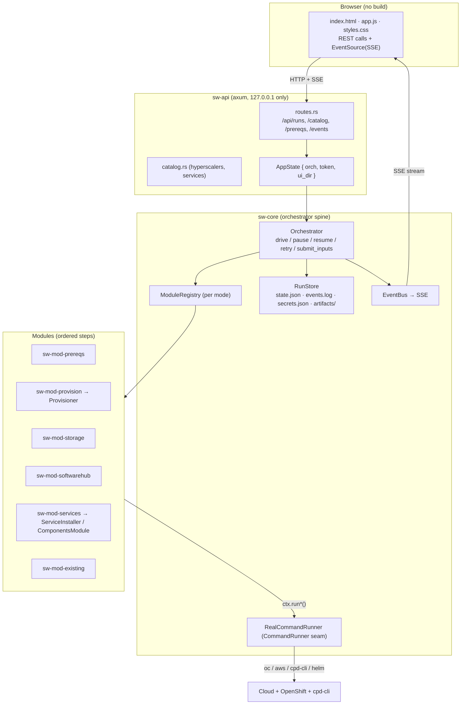
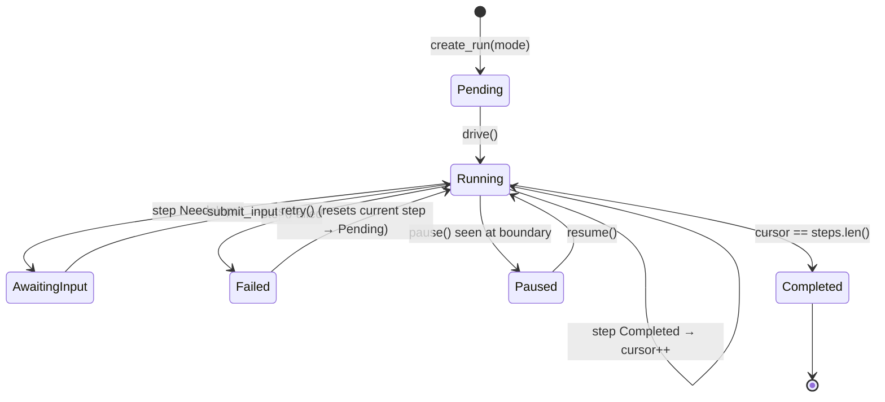
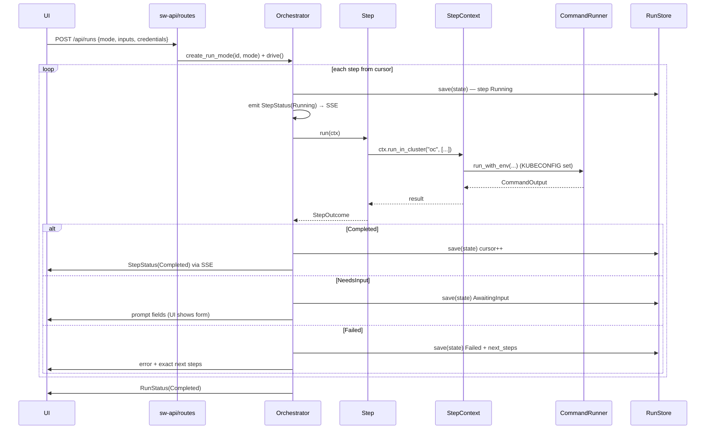
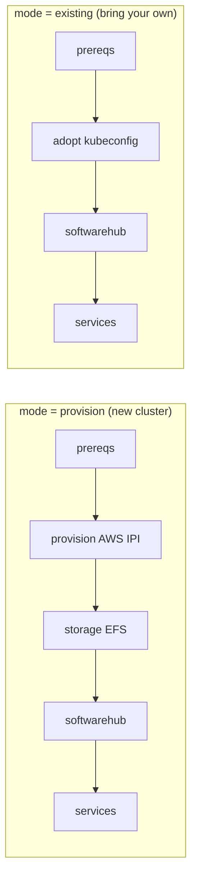
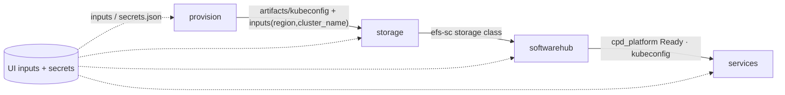

# Architecture

How the IBM Software Hub + watsonx.data Easy Installer (`wxd`) is built: the
layers, the core abstractions, how a run flows end to end, how state is persisted
and resumed after a failure, and the three seams you extend to add a cloud
provider, a service, or a whole new step graph.

> TL;DR — it's a **Cargo workspace** with a service-agnostic orchestrator core
> (`sw-core`), an axum web server + no-build UI (`sw-api`), and a set of
> pluggable **modules** (`sw-mod-*`) that each contribute ordered **steps**. The
> orchestrator flattens all modules into one step list and drives it forward,
> persisting state at every boundary so any failure is resumable. Everything
> external (every `oc` / `aws` / `cpd-cli` / `helm` call) goes through one
> `CommandRunner` seam, which makes the whole thing hermetically testable.

---

## 1. Design goals

| Goal | How it's realized |
|---|---|
| **Plug-n-play** | Modules register into a `ModuleRegistry`; the orchestrator doesn't know what any module does. |
| **Generic core, specific edges** | `sw-*` crates know nothing about watsonx.data; only `wxd-*` crates do. Other entitled services plug into the same seams. |
| **Resumable** | State is persisted after every step boundary; `retry`/`resume` re-drive from the cursor. |
| **Hermetic tests** | No module calls `std::process` directly — all external commands go through `CommandRunner`, mocked in tests. No cloud spend in CI. |
| **No build step for the UI** | `sw-api` serves static HTML/CSS/JS; the browser talks REST + SSE. |
| **Secret hygiene** | Secrets live in a `0600` `secrets.json`, never in `state.json`, and are redacted in logs. Server binds `127.0.0.1` only. |

---

## 2. Workspace layout

```
Cargo.toml                     # virtual manifest (workspace only — no root package)
crates/
  sw-core/                     # orchestrator spine (service-agnostic)
  sw-api/                      # axum server: REST + SSE + static UI
  sw-mod-prereqs/              # auto-install oc/helm/openshift-install/cpd-cli
  sw-mod-provision/            # Provisioner trait + AwsProvisioner (OpenShift IPI)
  sw-mod-storage/              # AWS EFS RWX storage (efs-sc)
  sw-mod-softwarehub/          # IBM Software Hub 5.4.x control plane
  sw-mod-services/             # ServiceInstaller trait + generic ComponentsModule
  sw-mod-existing/             # adopt an existing cluster via kubeconfig
  wxd-svc-watsonxdata/         # example ServiceInstaller impl for watsonx.data
  wxd-config/                  # legacy cpd_vars.sh generator CLI (standalone)
```

**Naming convention:** `sw-*` = generic IBM Software Hub infrastructure; `wxd-*`
= watsonx.data-specific. The split is deliberate — the whole `sw-*` stack can
install any entitled IBM service; watsonx.data is just the default.

---

## 3. Layered view



---

## 4. Core abstractions (`sw-core`)

Four traits/types carry the whole design. All live in `sw-core` and are
re-exported from its crate root.

### `Step` — one idempotent unit of work
```rust
#[async_trait]
pub trait Step: Send + Sync {
    fn id(&self) -> &str;                                  // stable, URL-safe
    fn title(&self) -> &str;                               // shown in the UI
    async fn run(&self, ctx: &StepContext) -> StepOutcome; // the work
}
```
Steps must be **idempotent** (check-then-act) so retry/resume is safe.

### `Module` — an ordered group of steps
```rust
pub trait Module: Send + Sync {
    fn id(&self) -> &str;
    fn title(&self) -> &str;
    fn steps(&self) -> Vec<Box<dyn Step>>;   // called fresh each drive
}
```

### `StepContext` — everything a step is allowed to touch
The step's only handle to the outside world. It carries the run id, the merged
non-secret `inputs`, the `secrets`, the `artifacts_dir`, an event sink, and — 
crucially — the **command seam**:

| Method | Use |
|---|---|
| `ctx.input(key)` / `ctx.secret(key)` | read a non-secret input / a secret |
| `ctx.log(line)` / `ctx.progress(pct)` | emit to the live log / progress (→ SSE + `events.log`) |
| `ctx.artifacts_dir()` | the run's `artifacts/` dir (kubeconfig, generated YAML, …) |
| `ctx.run(prog, args)` / `ctx.run_with_env(...)` | run a host command (redacts secrets in the echoed `$ cmd`) |
| `ctx.run_in_cluster(prog, args)` | run with `KUBECONFIG=<artifacts>/kubeconfig` set |
| `ctx.run_in_cluster_pty_env(...)` | run `cpd-cli manage` in a PTY with extra env + secret masking |

**No module ever calls `std::process` directly.** This single seam is why the
entire installer is testable without a cloud (see `MockCommandRunner`).

### `StepOutcome` — the three ways a step can end
```rust
pub enum StepOutcome {
    Completed,
    NeedsInput { prompt: String, fields: Vec<InputField> },   // pause + ask the UI
    Failed { error: String, next_steps: Vec<String> },        // stop + show exact fixes
}
```
`next_steps` is what the UI renders under a failed step — always fill it with
copy-pasteable, exact remediation.

---

## 5. The run state machine

A run is a `RunState { id, status, mode, steps[], cursor, inputs, pending_* }`.
The orchestrator drives the `cursor` forward through the flattened step list.



Key invariants (`orchestrator.rs::drive`):
- **State is saved at every boundary** — before running a step, after it completes,
  and on every pause/needs-input/fail. A crash loses at most the in-flight step.
- **Steps are never interrupted mid-call.** `pause()` sets a flag checked only at
  the *next* boundary.
- **`retry()`** resets the current (failed) step to `Pending`, clears its error,
  and re-drives from the same cursor.
- **`submit_inputs()`** merges non-secret values into `inputs`, writes secrets to
  the `0600` store, flips the awaiting step back to `Pending`, and re-drives.

---

## 6. End-to-end flow of one step



The UI subscribes to `GET /api/runs/:id/events` (SSE). Late subscribers get the
full history replayed from `events.log`, then live events — so refreshing the
page never loses the log.

---

## 7. Registries & modes — how the step graph is assembled

`sw-api/src/lib.rs` builds one `ModuleRegistry` per **mode** and hands the map to
the orchestrator:



`ModuleRegistry::flatten()` turns modules into one ordered `Vec<(module_id,
Step)>`; step ids in the UI are `"<module_id>/<step_id>"` (e.g.
`mod-softwarehub/install-platform`). A run records its `mode`, so resume/retry
always rebuild the *same* graph.

---

## 8. Persistence & resume (`RunStore`)

Everything lives under `~/.wxd/runs/<run-id>/`:

| File / dir | Contents | Notes |
|---|---|---|
| `state.json` | the whole `RunState` (status, steps, cursor, inputs) | rewritten at every boundary; the source of truth for resume |
| `events.log` | append-only JSON-per-line event stream | replayed for late SSE subscribers; the "Live log" |
| `secrets.json` | secret inputs only | `0600`; **never** referenced by `state.json` |
| `artifacts/` | `kubeconfig`, generated `install-config.yaml`, `cluster/`, cpd-cli workspace, EFS id, … | the module handoff surface |

**Resume model:** because `cursor` + per-step `status` are persisted, `resume()`
and `retry()` just `load()` the state and call `drive()` again from the cursor.
Idempotent steps make re-running the current step safe. There is no separate
"resume script" — the persisted `RunState` *is* the resume point.

---

## 9. Handoffs between modules

Modules never call each other. They communicate through two shared channels on
the `StepContext`, both persisted:

1. **`inputs` map** (`state.json`) — e.g. provision writes nothing new here, but
   the UI-provided `region`, `cluster_name`, `hyperscaler`, `VERSION`, chosen
   `components`, storage classes, etc. flow to every later step.
2. **`artifacts/` dir** — provision writes `artifacts/cluster/auth/kubeconfig`
   and copies it to `artifacts/kubeconfig`; storage writes `efs-fs-id.txt` and
   creates `efs-sc`; softwarehub logs the olm-utils container into OpenShift.
   `ctx.run_in_cluster(...)` automatically points `KUBECONFIG` at the run's
   kubeconfig, so downstream `oc`/`cpd-cli` steps just work.



---

## 10. Failure & recovery model

- A step returns `Failed { error, next_steps }` → the run stops at that cursor,
  the UI shows the error + the exact `next_steps`, and the **Retry** button calls
  `retry()` (reset step → re-drive). Because steps are idempotent, retrying after
  the user fixes the underlying issue (e.g. runs the `/etc/hosts` DNS command)
  picks up cleanly.
- A step returns `NeedsInput` → the run parks in `AwaitingInput`, the UI renders a
  form, and `submit_inputs()` resumes.
- Long waits (operator reconcile, node rollout) are modeled as **retryable
  failures** ("still reconciling — wait, then Retry") or as blocking
  `oc rollout status --timeout` calls inside the step.
- The cluster itself is the real state; steps re-derive from it (check-then-act),
  so a resumed run reconciles rather than blindly repeating.

---

## 11. Security model

- Server binds `127.0.0.1` only; `/api/*` requires a session token (header
  `x-wxd-token` or `?token=`), so the browser-native `EventSource` can auth.
- Secrets are written to `secrets.json` at `0600`, never placed in `state.json`,
  and redacted in the echoed `$ command` and in PTY output (`run_in_cluster_pty_masking`).
- Credentials fall back to `~/.aws/credentials` and `~/.ibm/IBM_ENTITLEMENT_KEY`
  when not supplied in the UI.

---

## 12. The three extension seams

This is the answer to "can I extend it?" — **yes, at three clean seams**, none of
which require touching the orchestrator.

### A. Add a **step** or **module**
Implement `Step` (and optionally group steps in a `Module`), then register the
module in the mode's `ModuleRegistry` in `sw-api/src/lib.rs`. The orchestrator
picks it up with no other changes. Use `ctx.run*` for all external calls so it
stays testable.

### B. Add a **cloud provider**
Implement the `Provisioner` trait (`sw-mod-provision`) and register it:

```rust
pub trait Provisioner: Send + Sync {
    fn id(&self) -> &str;                    // "azure", "gcp", "ibmcloud"
    fn spec_fields(&self) -> Vec<InputField>;      // UI cluster-spec form
    fn required_inputs(&self) -> Vec<&'static str>;
    async fn preflight(&self, ctx) -> StepOutcome;
    async fn ensure_dns(&self, ctx) -> StepOutcome;
    fn write_install_config(&self, ctx) -> Result<PathBuf, StepOutcome>;
    async fn create(&self, ctx) -> StepOutcome;
    async fn status(&self, ctx) -> StepOutcome;
    async fn destroy(&self, ctx) -> StepOutcome;
}
// ProvisionerRegistry::new().with(Arc::new(AzureProvisioner::new()))
```

`ProvisionModule` dispatches on the `hyperscaler` input, so the same steps
(`cluster-spec → preflight → ensure-dns → write-install-config → create-cluster`)
call your provider. The UI's cluster-spec form is generated from `spec_fields()`.
**Caveat:** RWX storage (`sw-mod-storage`) is AWS-EFS-specific today; a new cloud
needs an equivalent storage module (Azure Files / GCP Filestore) or a
storage-provider abstraction. `sw-mod-softwarehub` and `sw-mod-services` are
already cloud-agnostic (they only use `oc`/`cpd-cli` via the seam).

### C. Add a **service**
Two options:

1. **Catalog-driven (usually enough).** The generic `ComponentsModule`
   (`sw-mod-services`) installs *any* entitled component via
   `cpd-cli manage install-components --components <list>` — it already handles
   cluster-scoped resources, storage classes, and verification generically. To
   offer a new service, add it to `catalog::services()` with its `cpd-cli`
   component token; it becomes selectable in the UI multi-select and installs
   through the same flow. No new code path.
2. **Bespoke installer.** For custom install/verify logic, implement
   `ServiceInstaller` (see `wxd-svc-watsonxdata` as the reference) and compose it
   into a `ServicesModule::new(vec![...])`. Each installer contributes
   `install-<id>` + `verify-<id>` steps.

```rust
#[async_trait]
pub trait ServiceInstaller: Send + Sync {
    fn service_id(&self) -> &str;
    fn display_name(&self) -> &str;
    fn component(&self) -> &str;                     // cpd-cli COMPONENTS token
    async fn install(&self, ctx) -> StepOutcome;     // idempotent
    async fn verify(&self, ctx) -> StepOutcome;
}
```

### D. Add a **run mode** (new step graph)
Build a new `ModuleRegistry` and insert it into `registries()` keyed by a mode
name. The UI offers it automatically via `/catalog/modes`.

---

## 13. Where to look in the code

| You want to understand… | Read |
|---|---|
| The drive loop / state machine | `crates/sw-core/src/orchestrator.rs` |
| The core traits + command seam | `crates/sw-core/src/module.rs` |
| Run/step types & outcomes | `crates/sw-core/src/model.rs` |
| Persistence & resume | `crates/sw-core/src/store.rs` |
| Module ordering per mode | `crates/sw-api/src/lib.rs` |
| REST + SSE endpoints | `crates/sw-api/src/routes.rs` |
| Cloud provider seam | `crates/sw-mod-provision/src/lib.rs` |
| Service seam | `crates/sw-mod-services/src/lib.rs` + `crates/wxd-svc-watsonxdata` |
| The end-to-end operator walkthrough | `docs/running-the-installer.md` |
| Extending as an AI agent | `AGENTS.md` |
